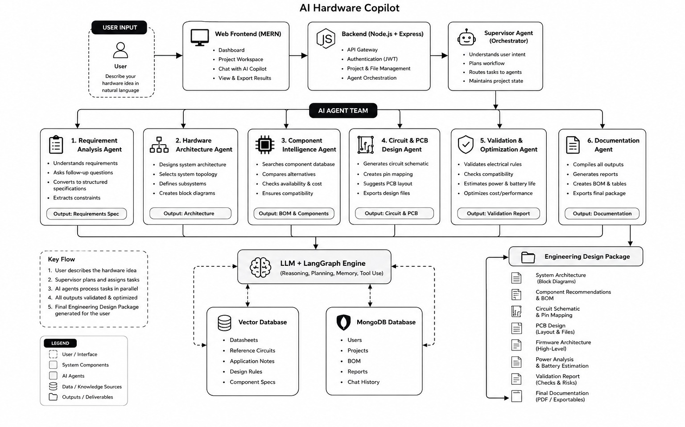

# Dunk AI

Dunk AI is an AI-powered hardware copilot that turns a natural-language hardware idea into a structured engineering design package.

The platform combines a Next.js web workspace, a Node.js API backend, and a Python AI engine. Users describe what they want to build, collaborate through project chat, and receive engineering outputs such as requirements, architecture, component recommendations, circuit and PCB guidance, validation results, and documentation.

## Architecture



The supplied architecture diagram is preserved in [`docs/dunk-ai-architecture.png`](docs/dunk-ai-architecture.png).

### Request flow

1. A user submits a hardware idea through the web frontend.
2. The frontend calls the Dunk AI Node.js/Express backend.
3. The backend authenticates the user and manages projects, chats, files, and persistence.
4. The backend sends AI workflow requests to the Supervisor Agent.
5. The Supervisor plans the workflow and routes work to the downstream Python agents.
6. Agent outputs are streamed via WebSockets back to the frontend, updating the interactive workspace tabs in real-time.
7. Outputs are validated, persisted, and assembled into an Engineering Design Package.

## Important service boundary

The Node.js backend has access to the Supervisor Agent only. It must not call the Requirement, Architecture, Component Intelligence, Circuit & PCB, Validation, or Documentation agents directly. Those agents are internal to the Python AI engine and are coordinated by the Supervisor.

The `ai_engine/` directory is an independent Python/LangGraph/LangChain system. The Node.js backend communicates with it through the configured Supervisor HTTP endpoint. This separation keeps API concerns and AI orchestration concerns independent.

## Repository structure

```text
.
├── ai_engine/             # Python AI agents and AI orchestration
├── backend/               # Dunk AI Node.js/Express API
│   ├── src/config/        # Environment and database configuration
│   ├── src/controllers/   # HTTP request handlers
│   ├── src/middleware/    # Auth, validation, uploads, and errors
│   ├── src/models/        # Mongoose data models
│   ├── src/repositories/  # Persistence abstraction
│   ├── src/routes/        # Versioned API routes
│   ├── src/services/      # Business logic and Supervisor client
│   ├── src/sockets/       # WebSocket handlers for real-time AI streaming
│   └── src/server.js      # Application entry point
├── docs/                  # Project documentation and diagrams
└── frontend/              # Next.js React Web Workspace
    ├── app/               # Next.js App Router (Auth, Dashboard, Workspace)
    ├── components/        # React components (Chat Interface, View Tabs, UI)
    ├── hooks/             # Custom React hooks (Store, API)
    └── lib/               # API clients and utilities
```

## Features & Recent Updates

- **Real-time Pipeline UI:** The Next.js frontend features a live, tabbed workspace (Chat, PCB, Requirements, Architecture, BOM, Validation, EDA, Docs). AI outputs stream directly into these tabs over WebSockets.
- **Multi-turn Context Retention:** The AI engine now maintains full conversation history across multiple turns without losing context. Fixed React state closure bugs to ensure accurate requirement tracking.
- **Dynamic BOM & Cost Mappings:** The Component Agent extracts and maps real-world `mfr_part` numbers, costs, and availability directly into the UI.
- **Responsive Layouts:** Flexbox-optimized view containers (`min-h-0`) ensure smooth scrolling and responsive rendering of long component tables and validation reports.
- **Architecture Visualization:** Real-time graph parsing and ReactFlow layouts for dynamic hardware topology diagrams.

## Backend capabilities

- JWT authentication, refresh sessions, roles, and user identity
- Project creation, editing, sharing, archiving, duplication, and ownership
- Project chat sessions and persisted conversation history
- Multipart file uploads for project assets and datasheets
- Supervisor-only workflow execution and chat orchestration
- MongoDB persistence with Mongoose models for users, projects, chats, messages, files, sessions, and artifacts
- Standard API responses, request validation, rate limiting, security headers, CORS, logging, and global error handling
- Swagger UI at `/docs` and a health endpoint at `/health`

## Getting started

### Backend

```powershell
cd backend
Copy-Item .env.example .env
npm install
npm run check
npm run dev
```

Configure these services before using the API:

- MongoDB through `MONGODB_URI`
- The Supervisor Agent through `SUPERVISOR_AGENT_URL` and `SUPERVISOR_AGENT_PATH`
- JWT secrets through `JWT_ACCESS_SECRET` and `JWT_REFRESH_SECRET`

The backend listens on the port configured by `PORT` (the current local environment uses `3000`). Never commit `.env`; secrets and runtime uploads are excluded by the repository `.gitignore`.

### Frontend

```powershell
cd frontend
npm install
npm run dev
```

The frontend runs on `http://localhost:3001` and connects to the backend API.

## Main API groups

| Group | Purpose |
| --- | --- |
| `/api/v1/auth` | Registration, login, refresh, logout, and current user |
| `/api/v1/projects` | Project lifecycle and collaboration |
| `/api/v1/chats` | Chat sessions and messages |
| `/api/v1/files` | Project file uploads and listings |
| `/api/v1/ai` | WebSocket streaming and Supervisor integration |

## Engineering principles

- Keep controllers thin and place business logic in services.
- Keep database access behind repositories/models.
- Keep AI communication behind the Supervisor client.
- Validate all client input and use environment variables for secrets.
- Build modules incrementally and verify them with `npm run check`.

## Project status

The backend foundation, Next.js frontend workspace, and core AI integrations are implemented and functional. The platform supports complete end-to-end hardware generation pipelines, from natural language prompt to BOM and Architecture outputs.
